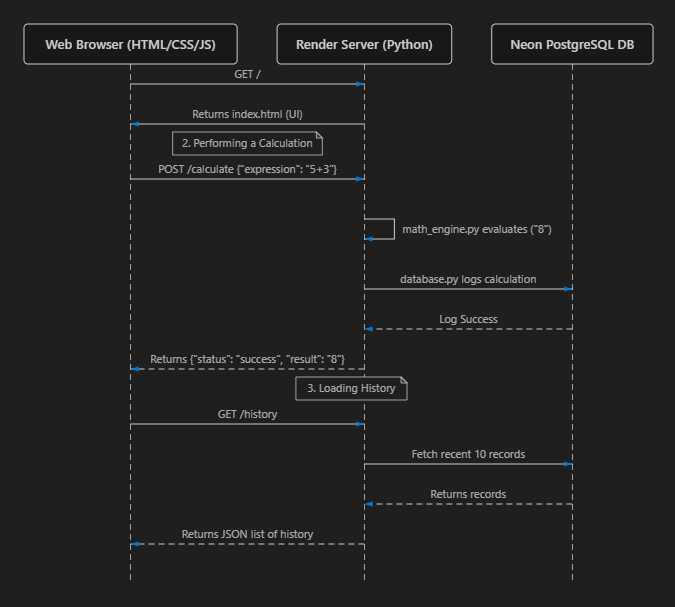
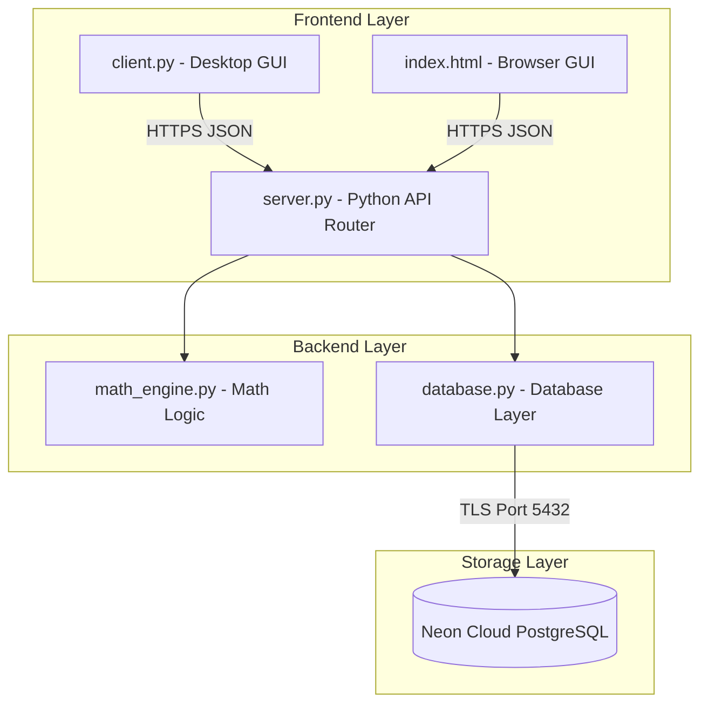

# Cloud-Connected Scientific Calculator (Full-Stack)

A modern, modular scientific calculator featuring a standalone **desktop GUI client** and a **responsive web browser interface** connected to a **Python API backend server** and a **Neon PostgreSQL cloud database**.

---

## 📸 Application Interface



---

## ⚙️ Architecture Design



### Key Technical Stack:
*   **Frontend GUI:** Python Tkinter (Desktop) & HTML/CSS/JavaScript (Web)
*   **API Routing:** Python `http.server`
*   **Database:** Neon serverless PostgreSQL
*   **Deployment:** Render (Backend API & Web Page Host)

---

## 🚀 Live Demo
The web app is deployed live and can be accessed at:
👉 **[https://calculator-server-1gfl.onrender.com/](https://calculator-server-1gfl.onrender.com/)**

---

## 🛠️ How to Run Locally

### Prerequisites
*   Python 3.x
*   PostgreSQL database connection credentials (configured in `.env` file)

### Setup Dependencies
Install required packages using pip:
```bash
pip install -r requirements.txt
```

### Step 1: Run the Backend Server
Start the local HTTP API server on port 5000:
```bash
python server.py
```

### Step 2: Open the Frontend Client
You can access the frontend in two ways:
*   **Option A (Web Browser):** Open `http://localhost:5000/` in your browser.
*   **Option B (Desktop Client):** Run the Tkinter desktop GUI:
    ```bash
    python client.py
    ```

---

## 📝 Features & Operations
*   **Standard Operations:** Addition, Subtraction, Multiplication, Division, Parentheses.
*   **Scientific Computations:** Trigonometry (`sin`, `cos`, `tan`), Logarithmic (`ln`, `log`), Exponentials, Powers (`x²`, `10ˣ`), Factorial, and Absolute Values.
*   **History Logs:** The sidebar pulls the last 10 calculations directly from the Neon PostgreSQL database. Clicking any history log loads the expression back into the active screen.
*   **Angle Modes:** Toggle between Degrees (DEG) and Radians (RAD) for trigonometric functions.
